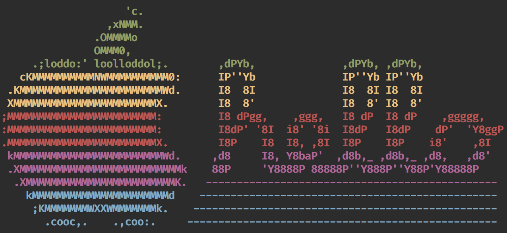

# Mac Setup Script
A personal BASH script intended to make setting up a Mac easier in accordance
with my preferences. The script relies heavily on :beer:[Homebrew](https://brew.sh/): The missing package manager for Macos™.

#### Usage
```
bash <(curl https://raw.githubusercontent.com/MatthewViens/mac-setup/master/mac-setup)
```