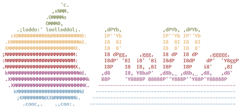

# Mac Setup Script
A personal BASH setup script intended to automate setting preferences and downloading 
software for a new Mac.

Preferences:
- Disables Gatekeeper.
- Deactivates Guest user account.
- Sets the default Finder window to Home.
- Disables automatic rearrangement of Spaces.
- Sets the Dock to auto-hide.
- Sets the minimize effect to scale.

CLI Apps:
- [Homebrew](https://brew.sh/)
- [rbenv](https://github.com/rbenv/rbenv)
- [nvm & npm](https://github.com/nvm-sh/nvm)
- [python & pip](https://www.python.org/)
- [shellcheck](https://github.com/koalaman/shellcheck)
- [tree](http://mama.indstate.edu/users/ice/tree/)
- [wget](https://www.gnu.org/software/wget/)
- [neofetch](https://github.com/dylanaraps/neofetch)
- [cmatrix](https://github.com/abishekvashok/cmatrix/)

Apps:
- [Atom](https://atom.io/)
- [Rectangle](https://rectangleapp.com/) 
- [iTerm2](https://iterm2.com)
- [Notable](https://notable.md/)

Fonts:
- [Fira Code](https://github.com/tonsky/FiraCode)

#### Usage
```
bash <(curl https://raw.githubusercontent.com/MatthewViens/mac-setup/master/mac-setup)
```

#### Acknowledgements
 - [Homebrew](https://brew.sh/): The missing package manager for MacOS.
 - [neofetch](https://github.com/dylanaraps/neofetch) for the Apple ASCII art.